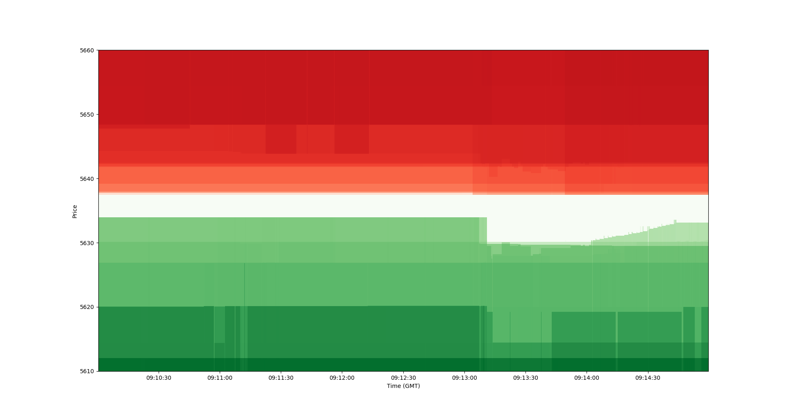

# Orderbook Visualizer

This project contains the code to plot the full order book tick by tick.

More information in this [blog post](https://www.linkedin.com/pulse/high-frequency-trading-bitcoin-exchanges-part-ii-eduardo-pena-vina/)

Also on [Reddit](https://www.reddit.com/r/algotrading/comments/e958hf/full_order_book_showing_high_frequency_trading_in/)

The sample data contains 30 minutes of raw tick-by-tick updates of the Level II orderbook in Coinbase Pro for the pair BTC-GBP on December 3rd 2019 during 9:06 am and 9:36am GMT. It contains 183542 lines, which means an average update each 10 ms.

## How to run

1. Unzip the data under data/raw_socket_capture_sample.zip

2. Install requirements (pip -r requirements.txt) for python 3.7

3. Run main.py

You should get something similar to the following image, showing the evolution of the order book for each price level along time.

